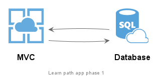
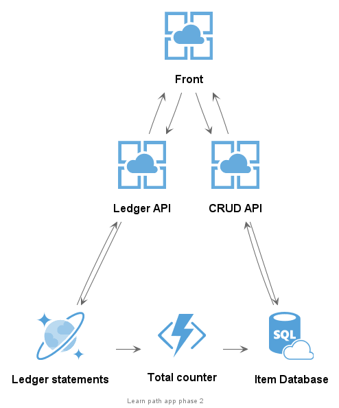
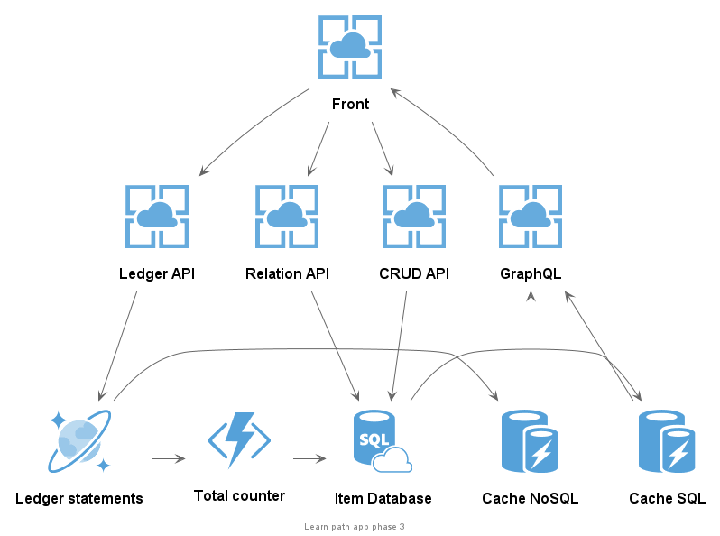

# Learn Path

## Overall Roadmap

- [ ] Basic understand of the lifecycle, permissions and policies of an azure service
- [ ] Basic idea of a pipeline in AzureDevops (testing, deploy to multiple env and secrets)
- [ ] Understand how to monitor performance in azure
- [ ] Understand how internal communication works in azure
- [ ] Understand the consistency options in CosmosDB
- [ ] Learn how to integrate an CosmosDB database with .NET
- [ ] Understand how to create an Azure functions
- [ ] Know wich triggers are available in azure functions
- [ ] Learn how to integrate azure functions with cosmosDB and SQL
- [ ] Learn how to publish and share a .NET library using Azure Devops
- [ ] Learn about most common pattern in redis cache
- [ ] Understand how to create a simple GraphQL and how to query it
- [ ] Learn how to implement the cache- [ ]aside pattern
- [ ] Learn about Service Fabric's Core Subsystems
- [ ] Learn how to migrate .NET Api to service fabric
- [ ] Learn how to run a local cluster
- [ ] Understand pros and cons of service fabric

## Phase 1 - The basics - (24h)

### Target knowledge:

- Basic understand of the lifecycle, permissions and policies of an azure service
- Basic idea of a pipeline in AzureDevops (testing, deploy to multiple env and secrets)
- Understand how to monitor performance in azure

### Hands on approach:

- Built a simple .NET Core MVC to insert and read items from a SQL database
- Create a pipeline to build, test and deploy
- Integrate with application insights

### Used technology 

- AppService
- AzureSQL
- MVC .NET Core
- Azure Devops
- EF Core
- Application Insights

### Diagram

___

## Phase 2 - Functions and comunication - (32h)

### Target knowledge:

- Understand how internal communication works in azure
- Understand the consistency options in CosmosDB
- Learn how to integrate an CosmosDB database with .NET
- Understand how to create and available triggers in Azure functions
- Learn how to integrate azure functions with cosmosDB and SQL
- Learn how to publish and share a .NET library

### Hands on approach:

- Spli MVC into a shared library, a CRUD API and Front-end app
- Create a pipeline to publish releases for a library
- Create an Ledger API to increment or decrement a item total
- Create a function that updates the item count, by triggering it when a insert is done

### Used technology 

- CosmosDB
- .NET Core API
- Azure Functions

### Diagram

___

## Phase 3 - Cache and GraphQL - (32h)

### Target knowledge:

- Learn about most common pattern in redis cache
- Understand how to create a simple GraphQL and how to query it
- Learn how to implement the cache-aside pattern

### Hands on approach:

- Add API to create relations between items
- Create a GraphQL server
- Create a Redis-Cache service
- Integrate Redis with GraphQL
- Replace reads to use a graphql query

### Used technology 

- GraphQL (HotChocolate)
- Redis-Cache

### Diagram

___

## Phase 4 - Service Fabric - (0h)
### Target knowledge:

- Learn about Service Fabric's Core Subsystems
- Learn how to migrate .NET Api to service fabric
- Learn how to run a local cluster
- Understand pros and cons of service fabric

### Hands on approach:

- Migrate AppServices to Service fabric
- Implement updates with 0 down time

### Used technology 

- Service fabric